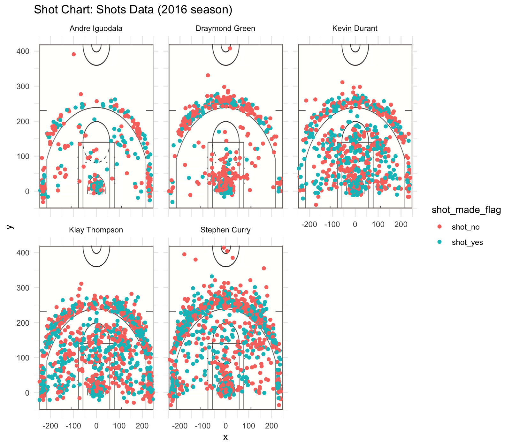

# Workout 01: GSW Shot Charts
## 5) Report
### 5.1) Effective Shooting Percentage
```{r}
library(dplyr)
shots_data <- read.csv("../data/shots-data.csv", stringsAsFactors = FALSE)
# 2PT Effective Shooting % by Player:
shots_data[shots_data$shot_type=="2PT Field Goal",] %>%
  group_by(name) %>%
  summarise(total = n(),
            made = sum(shot_made_flag=="shot_yes")) %>%
  mutate(perc_made = made/total) %>%
  arrange(desc(perc_made))

# 3PT Effective Shooting % by Player:
shots_data[shots_data$shot_type=="3PT Field Goal",] %>%
  group_by(name) %>%
  summarise(total = n(),
            made = sum(shot_made_flag=="shot_yes")) %>%
  mutate(perc_made = made/total) %>%
  arrange(desc(perc_made))

# Effective Shooting % by Player:
shots_data %>%
  group_by(name) %>%
  summarise(total = n(),
            made = sum(shot_made_flag=="shot_yes")) %>%
  mutate(perc_made = made/total) %>%
  arrange(desc(perc_made))
```  

### 5.2) Narrative: The Warriors can shoot!
#### Motivation and Background
The 2016-2017 season of Golden State Warriors was its 71st season in the NBA and also the 55th season in the San Francisco Bay Area. In this season, they created so many incredible miracles just as they did in the previous seasons.<sup>[1]</sup> The Warriors won their fifth NBA title by going 16-1, which set the best record in the NBA history.<sup>[2][3]</sup> Besides, The Warriors were on their way to equaling their 67-15 record from 2014-2015 regular season by breaking more than 20 NBA records.  

With the joining of free agent Kevin Durant in the offseason, the Warriors were hailed as a "Super Team" by their fans and the media. Also, Kevin Durant, Stephen Curry, Klay Thompson and Draymond Green were called a new all-star "Fantastic Four". Stephen Curry set numerous three-point NBA records this season, including the most three-points made in a single game with 13 and most consecutive games(regular-season and postseason combined) with a made three-pointer with 196.<sup>[4]</sup> As the NBA Finals Most Valuable Player, Andre Iguodala also made an significant contribution to help the Warriors win the championship.  

In the 2016-2017 regular season, it is reported that the league average get 111 points for every 100 shots, which means that 1.11 points is averagely achieved by a shot. 1.11 points per shot is also a good benchmark when assessing the value of a particular shot. The Warriors, a team stacked with incredible shooters, far exceeded that mark by getting averaging 1.21 points per shot. By analyzing the shooting statistics of the Golden State Warriors, perhaps we will be able to understand why the Warriors has repeatedly made history.


#### Data and Analysis
Our data includes the shooting data of the five Golden State Warriors players: Andre Iguodala, Draymond Green, Kevin Durant, Klay Thompson, Stephen Curry. The data frame "shots_data" includes the details of every shot attempt by the five players, such as the time of the attempt in the game, whether the shot was made or missed, the action type, whether it was a 2-point field goal or a 3-point field goal, shot distance and the court coordinates where a shot occurred.   

With these shot data, we are able to draw shot charts based on the coordinates and summarize the effective shooting precentages of 2-point, 3-point and the total like following:  

```{r out.width='80%',echo=FALSE,fig.align='center'}

```

**2PT Effective Shooting Percentage by Player:**
```{r echo=FALSE}
library(dplyr)
shots_data <- read.csv("../data/shots-data.csv", stringsAsFactors = FALSE)
# 2PT Effective Shooting % by Player:
shots_data[shots_data$shot_type=="2PT Field Goal",] %>%
  group_by(name) %>%
  summarise(total = n(),
            made = sum(shot_made_flag=="shot_yes")) %>%
  mutate(perc_made = made/total) %>%
  arrange(desc(perc_made))
```  
From the 2PT effective shooting percentage by player, Kevin Durant and Klay Thompson are the two players who attempted to make the most 2-point shots. Their total shots were almostly the same, which were 643 and 640. However, the number of made shots of Kevin Durant (390) were much higher than that of Klay Thompson (329), which made Kevin Durant the shooter with the second highest success shot percentage. Although Andre Iguodala made the least attempts of 2-point shots, he was the shooter with the highest success shot percentage, which was 0.638.

**3PT Effective Shooting Percentage by Player:**
```{r echo=FALSE}
# 3PT Effective Shooting % by Player:
shots_data[shots_data$shot_type=="3PT Field Goal",] %>%
  group_by(name) %>%
  summarise(total = n(),
            made = sum(shot_made_flag=="shot_yes")) %>%
  mutate(perc_made = made/total) %>%
  arrange(desc(perc_made))
```  
As can be seen from the 3PT effective shooting percentage by player, it is obvious that Stephen Curry and Klay Thompson both played an important role in contributing points by making 3-point shots. Stephen Curry made the most total shots (687) and made shots (280) and thus got the second highest success shot percentage(0.408) while Klay Thompson got the highest success shot percentage (0.424) by making 580 total shots and 246 made shots. Although it is hard for the other three players to compete with Stephen Curry and Klay Thompson in 3-point shots, compared to the average level of the league, they still achieve relatively high success shot percentages.

**Effective Shooting Percentage by Player:**
```{r echo=FALSE}
# Effective Shooting % by Player:
shots_data %>%
  group_by(name) %>%
  summarise(total = n(),
            made = sum(shot_made_flag=="shot_yes")) %>%
  mutate(perc_made = made/total) %>%
  arrange(desc(perc_made))
```  
As for the total effective shooting percentage by player, although he didn't make the most shots, Kevin Durant became the first by achieving a precentage of 0.541, which is incrediblly high. Andre Iguodala is shooter with the second highest success percentage. The third and fourth shooters are Klay Thompson and Stephen Curry. They made more than 1200 attempts including more than 500 made shots and achieve success percentages of 0.471 and 0.467.

#### Discussion and Conclusion
The five players of the Golden State Warriors are all top shooters extremely high level across the world. Andre Iguodala is better at shooting two pointers. He didn't try that many time compared to the other four players. But he achieve the highest success percentage of 2-point shots. It might be because he was more cautious or it might be included in the strategy and plan of the whole team. Stephen Curry and Klay Thompson are the most important shooters who made the most shots and contributed the most points. Although they are also excellent in shooting 2-pointers, they are more dominant on three pointers. If there is a chance to shoot 3-pointers, they will be the most suitable players to do that. Kevin Durant achieve the highest effective shooting percentage and his abilities of 2-pointers and 3-pointers are balanced. Draymond Green became the last player in both 2-pointers and 3-pointers.

#### References
1. "Purdy: Put a pause on the dynasty talk–and just enjoy this Warriors title". Mercury News. Retrieved June 12, 2017.  
2. "Kevin Durant makes the Warriors the villain the NBA needs". Fox Sports. July 4, 2016.  
3. "Durant's move to Warriors brings NBA 'Superteam' talk". Yahoo News. July 5, 2016.  
4. "Warriors" (PDF). nba.com. Retrieved March 18, 2016.  


